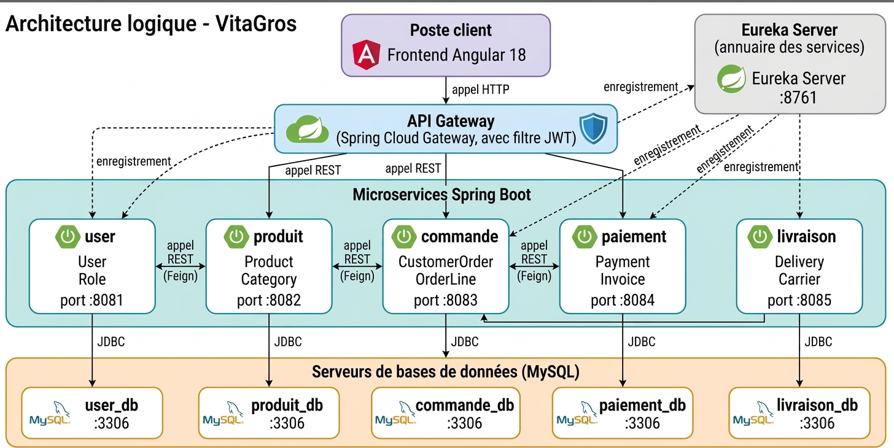
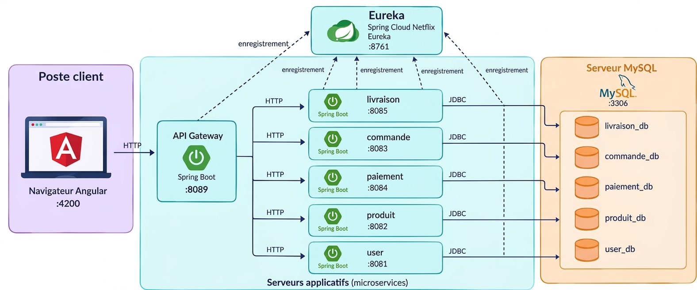
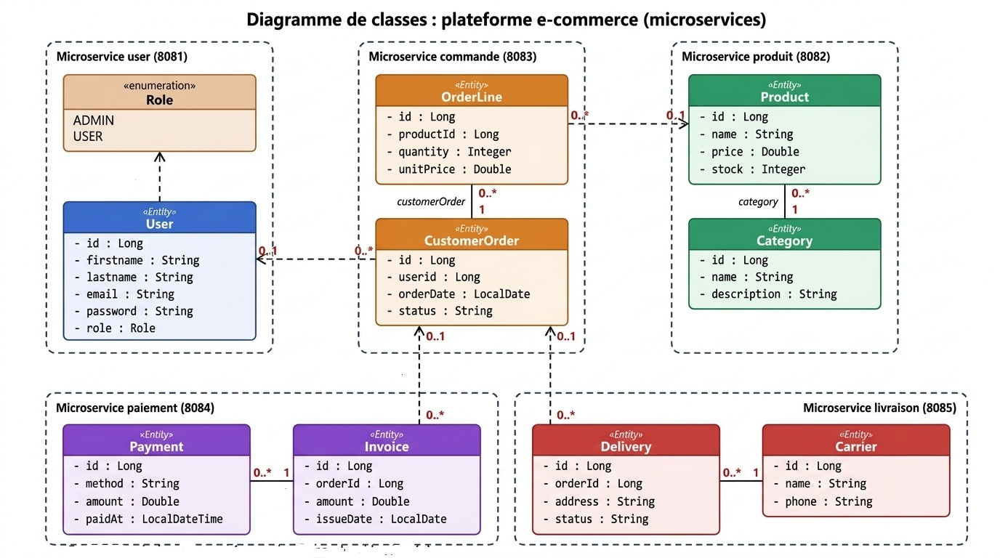

<div align="center">

# 🛒 VitaGros

**Plateforme e-commerce en architecture Microservices**
catalogue · commandes · paiement · livraison


</div>

---

## 📑 Sommaire
1. [Présentation](#-présentation)
2. [Architecture](#-architecture)
3. [Microservices](#-microservices)
4. [Modèle de données](#-modèle-de-données)
5. [Frontend](#-frontend)
6. [Installation et lancement](#-installation-et-lancement)
7. [Documentation des API](#-documentation-des-api)
8. [Structure du dépôt](#-structure-du-dépôt)
9. [Limites et perspectives](#-limites-et-perspectives)
10. [Équipe](#-équipe)

---

## 🎯 Présentation

VitaGros permet à un **client** de parcourir un catalogue, de passer commande, de payer et de suivre sa livraison, et à un **administrateur** de gérer l'ensemble de la plateforme.

L'application est découpée en **5 microservices autonomes** (user, produit, commande, paiement, livraison). Chacun possède son code, sa configuration, son port et sa **propre base MySQL** (*database per service*). Un serveur **Eureka** assure la découverte des services et un frontend **Angular 18** consomme les API REST.

| Acteur | Ce qu'il peut faire |
|---|---|
| **Client** (`USER`) | S'inscrire, se connecter, consulter les produits, commander, payer, suivre ses livraisons |
| **Administrateur** (`ADMIN`) | Gérer utilisateurs, produits, catégories, commandes, factures, paiements, transporteurs et livraisons |

---

## 🏗️ Architecture

### Architecture logique
Découpage en services, entités portées par chaque service, base dédiée et enregistrement dans Eureka.



### Architecture physique (déploiement)
Poste client, serveurs applicatifs avec leurs ports, serveur MySQL et protocoles échangés.



### Principes retenus
- **Database per service** : aucune base partagée, aucune clé étrangère entre services.
- **Liens par identifiant** : `commande` référence `userId` et `productId` ; `paiement` et `livraison` référencent `orderId`.
- **Service discovery** : chaque microservice s'enregistre dans Eureka au démarrage.
- **API REST documentées** par Swagger / OpenAPI sur chaque service.
- **Gestion d'erreurs homogène** : `400` validation, `404` introuvable, `409` conflit d'intégrité.

---

## 🧩 Microservices

| Service | Port | Base | Responsabilité | Swagger |
|---|---|---|---|---|
| **Eureka** | 8761 | — | Annuaire des services | [Dashboard](http://localhost:8761) |
| **user** | 8081 | `user_db` | Comptes et rôles (`ADMIN`, `USER`) | [Swagger](http://localhost:8081/swagger-ui.html) |
| **produit** | 8082 | `produit_db` | Catalogue : produits, catégories, stock | [Swagger](http://localhost:8082/swagger-ui.html) |
| **commande** | 8083 | `commande_db` | Commandes et lignes de commande | [Swagger](http://localhost:8083/swagger-ui.html) |
| **paiement** | 8084 | `paiement_db` | Factures et paiements | [Swagger](http://localhost:8084/swagger-ui.html) |
| **livraison** | 8085 | `livraison_db` | Livraisons et transporteurs | [Swagger](http://localhost:8085/swagger-ui.html) |

Chaque service a son propre `README.md` : [`user`](Backend/Microservices/user/README.md) · [`produit`](Backend/Microservices/produit/README.md) · [`commande`](Backend/Microservices/commande/README.md) · [`paiement`](Backend/Microservices/paiement/README.md) · [`livraison`](Backend/Microservices/livraison/README.md) · [`Eureka`](Backend/Eureka/README.md)

### Endpoints principaux

| Service | Ressources |
|---|---|
| user | `/api/users`, `/api/roles` |
| produit | `/api/products`, `/api/categories` |
| commande | `/api/orders`, `/api/order-lines` |
| paiement | `/api/invoices`, `/api/payments` |
| livraison | `/api/deliveries`, `/api/carriers` |

Chaque ressource expose `GET` (liste), `GET /{id}`, `POST`, `PUT /{id}` et `DELETE /{id}`.

---

## 🗂️ Modèle de données



| Service | Entités | Relation interne |
|---|---|---|
| user | `User`, `Role` (enum `ADMIN` / `USER`) | `User.role` |
| produit | `Product`, `Category` | `Product` → `Category` (n:1) |
| commande | `CustomerOrder`, `OrderLine` | `OrderLine` → `CustomerOrder` (n:1) |
| paiement | `Invoice`, `Payment` | `Payment` → `Invoice` (n:1) |
| livraison | `Delivery`, `Carrier` | `Delivery` → `Carrier` (n:1) |

> Les références **entre** services (`userId`, `productId`, `orderId`) sont de simples identifiants, sans clé étrangère.

---

## 🖥️ Frontend

Application **Angular 18** (port 4200) qui appelle directement les microservices.

- Authentification : connexion, inscription, accès par rôle (`ADMIN` / `USER`) via un guard
- Tableau de bord et profil utilisateur
- Pages produits et catégories, panier, commandes, paiements, livraisons, utilisateurs

---

## 🚀 Installation et lancement

### Prérequis
- JDK 17 et Maven
- Node 18.19+ ou 20
- MySQL sur `localhost:3306` (utilisateur `root`, mot de passe vide ; sinon modifier `src/main/resources/application.properties` de chaque service)

Les bases sont créées automatiquement au démarrage de chaque service.

### Démarrage (dans cet ordre)

```bash
# 1. Eureka
cd Backend/Eureka && mvn spring-boot:run

# 2. Les 5 microservices (un terminal chacun)
cd Backend/Microservices/user      && mvn spring-boot:run
cd Backend/Microservices/produit   && mvn spring-boot:run
cd Backend/Microservices/commande  && mvn spring-boot:run
cd Backend/Microservices/paiement  && mvn spring-boot:run
cd Backend/Microservices/livraison && mvn spring-boot:run

# 3. Frontend  ->  http://localhost:4200
cd Frontend && npm install && npm start
```

Vérifier que les 5 services apparaissent sur http://localhost:8761.

### Ordre de saisie conseillé
Créer d'abord les éléments parents, puis les enfants :
`Category` → `Product` · `CustomerOrder` → `OrderLine` · `Invoice` → `Payment` · `Carrier` → `Delivery`

### Récapitulatif des ports

| Composant | Port |
|---|---|
| Frontend Angular | 4200 |
| user / produit / commande / paiement / livraison | 8081 / 8082 / 8083 / 8084 / 8085 |
| Eureka | 8761 |
| MySQL | 3306 |

---

## 📘 Documentation des API

Chaque microservice expose :
- **Swagger UI** : `http://localhost:<port>/swagger-ui.html`
- **OpenAPI (JSON)** : `http://localhost:<port>/v3/api-docs`

---

## 📁 Structure du dépôt

```
Projet
├── Backend
│   ├── Eureka                       discovery server (8761)
│   └── Microservices
│       ├── user                     (8081)  User, Role (enum)
│       ├── produit                  (8082)  Product, Category
│       ├── commande                 (8083)  CustomerOrder, OrderLine
│       ├── paiement                 (8084)  Invoice, Payment
│       └── livraison                (8085)  Delivery, Carrier
├── Frontend                         Angular 18 (4200)
├── documentation                    schémas d'architecture et diagramme de classes
└── README.md
```

Organisation interne de chaque microservice :

```
com.awd.<service>
├── config        CORS, OpenAPI, gestion des erreurs
├── controller    API REST
├── entity        entités JPA
├── repository    Spring Data JPA
└── service       logique métier
```

---

## ⚠️ Limites et perspectives

**Limites actuelles**
- Le frontend appelle directement chaque service : il n'y a pas encore d'API Gateway.
- Les services ne s'appellent pas entre eux : `userId`, `productId` et `orderId` ne sont pas vérifiés.
- L'authentification est faite côté frontend à partir de `GET /api/users`, et les mots de passe sont stockés en clair. Elle n'est donc pas sécurisée.
- Aucun test automatisé pour l'instant.

**Feuille de route**
- [ ] API Gateway (Spring Cloud Gateway) comme point d'entrée unique
- [ ] Authentification JWT et hachage des mots de passe (BCrypt)
- [ ] Appels interservices (OpenFeign) et validation des références
- [ ] Parcours complet commande → paiement → livraison avec statuts
- [ ] Résilience (Resilience4j) et événements asynchrones (RabbitMQ / Kafka)
- [ ] Tests unitaires et d'intégration, collection Postman
- [ ] Docker et `docker-compose`, intégration continue

---

## 👥 Équipe

Projet réalisé à **ESPRIT** dans le cadre du module d'architecture Microservices.

| Membre | Rôle |
|---|---|
| _Nom Prénom_ | _à compléter_ |
| _Nom Prénom_ | _à compléter_ |
| _Nom Prénom_ | _à compléter_ |
| _Nom Prénom_ | _à compléter_ |
